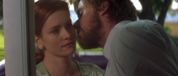
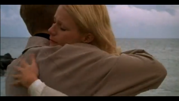
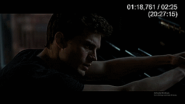
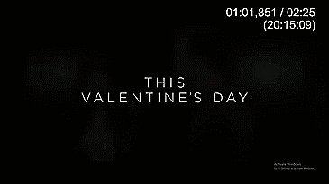

# Skip This Scene

The objective of this app is to convert, in real time, any movie or series into a family friendly movie/series.

### Notes before downloading:
	1. The app does not currently support CPU inference. Meaning this app will NOT work if you don't have an Nvidia GPU
	2. Avoid 4k resolution. This will drop detection FPS significantly
	
### Download:
[Windows_10_x64.zip](https://drive.google.com/file/d/15e1y1XLuwMjH-IwAEtIS33bf_dFRalwb/view?usp=sharing)

Reasons for creating the app:
	1. Research & Application Purposes (ML/AI)
	2. Watch any series with family
	3. Reduce awkward moments with family
	 
Baseline Requirements:
	1. Nvidia GPU
	3. Windows 10 64bit
	4. Media Player. Preferably VLC Media Player.
	4. Movie/Series on Full screen
	5. Family
 
Baseline Expectations:
	1. The app should skip scenes 93% of the time.
	2. The app will make mistakes. Expect an average 3 wrong skips a movie.
	
### Current Categories:

Category 	  |Description              																| Sample
---------:	  |--------------------------------------------------------------------------------------:  | :---------------------------: 
Kiss  		  |Obvious Images 																			|      
Not Kiss	  |False Positive Images  Images that look like kiss  Images that are almost kiss		| 
Other		  |Images that don't belong to any category.												| 

### Future Categories:
	1. Nudity
	2. Gore
	
## Video Sample:

	
### Action Example:

Action    		|Reason	  					|App      			   | Behind The Scenes
---------:		|--------------------:	  	|--------------------: | :---------------------------: 
Action Not Taken|Sequence is too short		| |      
Action Taken 	| Sequence is long enough	|	   | 
		
	 
### Future Updates sorted by priority:
	1. 2nd Monitor Support
	2. CPU Inference Support
	3. Linux/MacOS support (upon request)
	3. New Categories(will only add new categories based on the number of people requesting it)
	4. OOP & Code optimization
	5. Implement a formal spatiotemporal solution
	6. Include sound classification
	7. UI update/replacement

# Frequently Asked Questions

## Q: How can I Contribute/Report/Suggest?
		1. Send me PR requests or issue requests
		2. Share the app. The more the people, the more likely I'd support it
		3. Send me new images of categories you'd like me to include with the following format:
			-- Movie
				|-- Category A
					|-- image.jpg
				|-- Category B
					|-- image.jpg

## Q: How do I know the app is working?	
		1. Run SkipthisScene.exe
		2. Wait around 20 seconds
		2. Click 'run' once the menu opens
		3. Wait around 20 seconds
		4. The 'run' button should change to 'stop' 
		5. Google search a category.
		6. Click on an image
		7. It should move to the next image.
		
## Q: Why didn't it do anything?
		1. Some media players delay or block screencapture.
		2. The scene wasn't long enough to trigger the skip action.
		3. The app just immitates the pressing of the right arrow key to fast forward.
			a. Check if your media player supports the right arrow key button to fast forward. If not then you can change the default key in the main menu.
			b. On some players, you will need to click on the time slider before the right arrow key button works.
		4. It just didn't detect it. 
		5. Was the app running?
		
## Q: How does the app work?
		1. It captures an image of your screen 
		2. Resizes the image to a more manageable size
		3. Resized image is fed into the model
		4. Model detects a category
		5. Consecutive detections trigger button press(default: Right arrow key) 
		6. Button press fast forwards movie.
		7. Repeat
	
## Q: Will it work with my subscription service?
	A. As long as they don't block screencapture, It should.
		
## Q: Why does it still make mistakes:
		1. Small dataset
		2. Few categories
		3. Im still learning ML/AI
		4. Will improve it over time
		5. A model is never perfect
		 
## Q: Will you be releasing the dataset?
	A. No.
	
## Q: Why is the UI so ugly?
	A: no u. 
	   jk. It was rushed, I may move the GUI to another language/API.
	
## Q: Have you considered censoring instead?
	A: Yes, tried and tested but it drastically reduces FPS. Plus, censoring looks unnatural.
	
## Q: Hardest Parts of creating the app:
		1. Annotating images. 2.5k images took a month.
		2. Reducing missclassifications. Especially edge cases and odd camera angles.
		3. Optimizing Tensorflow model.
		4. Building a simple and lightweight method that takes into account some of the Spatio-temporal context information. CNN+LSTM approach is too computationally expensive.
			a. Alternative solution implemented:
					i. Made bounding boxes larger for all images, to include other information(shoulders close together, hands on face,etc.)
					ii. Set a threshold count before an action is taken(skip)
					iii. Threshold was set based on class accuracy & other statistial metrics. Currently it is set to 16% of frames/2sec. Meaning 16% of frames in the past 2 seconds must contain a detection.
					

